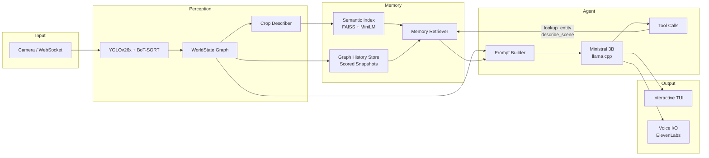
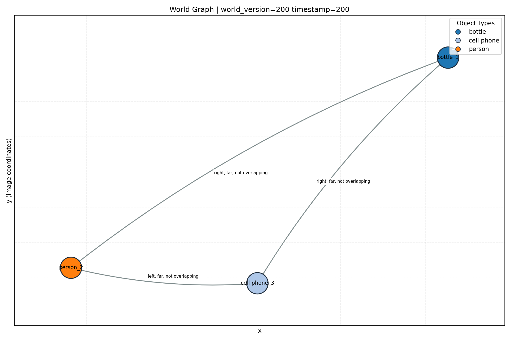

# Worldstate Embodied AI

A proof-of-concept framework for embodied AI agent that perceives the real world through a webcam and builds a persistent structured scene memory, and reasons about what it sees using a local LLM — all running on-device.

Worldstate Embodied AI connects real-time computer vision (YOLOv26x + BoT-SORT tracking) to a local language model (Ministral 3B via llama.cpp) through a novel world-state graph and dual-store memory system. The agent can detect objects, track their motion, remember what it has seen, answer questions about the scene, and narrate events as they happen — with optional voice I/O via ElevenLabs.

## Architecture



## Features

- **Real-time object detection and tracking** — YOLOv26x with BoT-SORT multi-object tracking, producing persistent track IDs across frames.
- **Structured world-state representation** — A live scene graph with tracked objects, pairwise spatial relations, motion detection, and event history (see [World State Representation](#world-state-representation) below).
- **Dual-store memory system** — FAISS semantic vector index for entity recall plus scored graph-history snapshots with intelligent eviction (see [Dual-Store Memory System](#dual-store-memory-system) below).
- **Local LLM inference** — Ministral 3B (GGUF) via llama.cpp with GPU offload, CPU fallback, and streaming token generation.
- **Tool calling** — The agent can invoke `lookup_entity` and `describe_scene` tools to query its own memory and perception state.
- **Interactive TUI** — Textual-based terminal UI with real-time transcript, status bar (world version, frame count), text input, and voice recording.
- **Voice I/O** — ElevenLabs STT and TTS for spoken conversation with the agent.
- **WebSocket frame ingest** — Stream video frames from remote cameras or browsers via a FastAPI websocket endpoint, with automatic local/API source switching.
- **Graph visualization** — Periodic PNG snapshots of the world graph rendered via NetworkX and Matplotlib.



- **Multimodal crop description** — Background thread describes detected object crops via multimodal LLM inference and indexes the descriptions for semantic search.

## How It Works

### World State Representation

`perception/yoloworldstate.py` maintains a structured, thread-safe scene graph that transforms raw YOLO detections into a semantic representation suitable for LLM reasoning. The world state is updated every frame and produces JSON snapshots consumed by the prompt builder.

#### WorldObject

Each tracked detection becomes a `WorldObject` with:

| Field                      | Description                                         |
| -------------------------- | --------------------------------------------------- |
| `track_id`                 | Persistent ID from BoT-SORT (survives occlusion)    |
| `type`                     | Class label from YOLO (e.g. `person`, `cell phone`) |
| `center`                   | Bounding box centroid `(x, y)`                      |
| `velocity`                 | Per-frame displacement `(vx, vy)`                   |
| `moving`                   | Boolean motion state with hysteresis                |
| `visible`                  | Whether the object is currently detected            |
| `confidence`               | YOLO detection confidence                           |
| `first_seen` / `last_seen` | Frame lifecycle timestamps                          |

**Motion detection** uses hysteresis to avoid flicker: an object is declared "moving" only after `MOTION_START_CONTINUOUS_FRAME_THRESHOLD` (4) consecutive frames above the speed threshold, and "stopped" only after `MOTION_STOP_CONTINUOUS_FRAME_THRESHOLD` (4) consecutive frames below it. This prevents noisy detections from generating spurious motion events.

**Disappearance detection** marks an object as missing after `DISAPPEARANCE_THRESHOLD` (15) consecutive frames without a matching detection, generating a critical event for the agent.

#### Relation

Pairwise spatial relations are computed between all visible objects using:

- **Direction**: `atan2`-based mapping into 8 compass directions (`above`, `upper right`, `right`, `bottom left`, etc.) representing the relative position of object A with respect to object B.
- **Proximity**: Euclidean distance compared against `DISTANCE_THRESHOLD` (100px) to classify pairs as `near` or `far`.
- **Overlap**: IoU (Intersection over Union) compared against `IOU_THRESHOLD` (0.5) to detect overlapping bounding boxes.

Relations are keyed by `frozenset({id_a, id_b})` and updated incrementally each frame (delta updates, not full recomputation).

#### Event Log

The world state maintains a rolling event log (capped at 20 entries) that records:

- **Appearance**: `"cell_phone_3 appeared at frame 142"`
- **Motion start with direction**: `"person_1 moved left at frame 200"`
- **Motion stop**: `"person_1 stopped at frame 215"`
- **Disappearance**: `"cup_5 disappeared at frame 340"` (triggers `critical` flag)

The `critical` flag signals the agent loop that an event warrants an unprompted response (Event Mode).

#### Snapshot Format

`WorldState.snapshot()` produces a JSON dict consumed by the prompt builder:

```json
{
  "critical": false,
  "world_version": 1042,
  "timestamp": 3150,
  "frame_size": { "width": 1920, "height": 1080 },
  "objects": [
    {
      "id": 1,
      "type": "person",
      "position": { "x": 540, "y": 320 },
      "velocity": { "x": -3, "y": 0 },
      "state": { "visible": true, "moving": true },
      "confidence": 0.9214,
      "first_seen": 10,
      "last_seen": 3150
    }
  ],
  "relations": [
    {
      "subject": "person_1",
      "relation": "right, near, not overlapping",
      "object": "laptop_2",
      "last_updated": 3150
    }
  ],
  "recent_events": [
    "person_1 moved left at frame 3100",
    "cup_5 disappeared at frame 3020"
  ]
}
```

### Dual-Store Memory System

The `memory/` module implements a dual-store architecture that gives the agent both **semantic recall** ("what did I see that looked like X?") and **situational context** ("what was happening around entity Y the last time I saw it?").

#### Semantic Index (`memory/semantic_index.py`)

Entity descriptions (generated by the crop describer from object image crops) are embedded into 384-dimensional vectors using `all-MiniLM-L6-v2` (via `memory/embeddings.py`) and stored in a FAISS `IndexFlatIP` index.

Key design decisions:

- **Normalized embeddings**: All vectors are unit-length, so inner product equals cosine similarity — enabling exact nearest-neighbor search without additional normalization at query time.
- **One entry per track ID**: Each tracked object is indexed at most once (first description wins). This prevents the index from being dominated by repeatedly-seen objects.
- **Lock-minimized writes**: The expensive embedding computation runs outside the critical section; only the FAISS insertion and metadata bookkeeping hold the lock.
- **Flat index**: `IndexFlatIP` performs brute-force exact search. This is appropriate because the entity count is expected to be small (dozens to hundreds per session, not millions).

#### Graph History Store (`memory/graph_history.py`)

The graph history store saves periodic snapshots of the world graph (every N world versions, default 50) in a bounded buffer (default 100 snapshots). When the buffer is full, a **score-based stochastic eviction policy** removes low-value snapshots while preserving temporal diversity.

**Snapshot scoring** combines four weighted components:

| Component                | What it measures                                       | Intuition                                    |
| ------------------------ | ------------------------------------------------------ | -------------------------------------------- |
| Age score                | Exponential decay from current time                    | Recent snapshots are more relevant           |
| Visible entity count     | Ratio of visible entities to a reference count         | Busier scenes carry more information         |
| Description length RMS   | RMS of text description lengths for visible entities   | Richly-described scenes are more valuable    |
| Entity time-in-frame RMS | RMS of `(last_seen - first_seen)` for visible entities | Longer-tracked entities are more established |

**Stochastic eviction**: Rather than deterministically evicting the lowest-scored snapshot, the store uses inverse-score weighted random selection (`weight = 1 / (score + epsilon)`). This means low-scoring snapshots are _likely_ to be evicted but not _guaranteed_ — preserving temporal diversity and preventing the history from clustering around only the most "interesting" moments.

**Protected recent snapshots**: The N most recent snapshots (configurable) are excluded from eviction candidates, ensuring the agent always has access to recent context regardless of score.

**Graph pruning**: Before storage, each snapshot is pruned to include only visible objects and relations where at least one endpoint is visible. This reduces storage overhead and ensures the snapshot reflects the actual observable state.

#### Memory Retriever (`memory/retriever.py`)

The `MemoryRetriever` unifies both stores at query time:

1. **Semantic search** (`query_context`): Embeds the query, searches the FAISS index for top-K matches, and enriches each result with the latest graph context from when that entity was visible.
2. **Full memory dump** (`all_entity_memory_context`): Returns all indexed entity memories sorted by recency, used as auxiliary context in every agent prompt.
3. **Structured lookup** (`lookup_entities`): Filters entities by exact track ID and/or class name, used by the `lookup_entity` tool.

Each result item includes whether the entity is currently visible, its semantic description, the indexed world version, and an optional graph summary showing what objects and relations surrounded it the last time it was seen.

### Agent Reasoning Loop

The agent operates in a continuous loop with two trigger modes:

**Event Mode**: When the world state's `critical` flag is set (currently triggered by object disappearance), the agent generates an unprompted observation. The system prompt instructs it to make inferences ("if something vanishes near a bag, it went in the bag") and keep responses to one sentence.

**User Mode**: When a user sends a message (via TUI text input or voice), the agent answers using up to 3 sentences, grounding its response in the current scene state and memory context.

Each agent turn assembles a prompt from:

1. **System prompt** — Defines the agent's persona and style rules (no markdown, no track IDs, natural language).
2. **Scene state JSON** — Current `WorldState.snapshot()` with objects, relations, and events.
3. **Auxiliary context** — Object descriptions from the crop describer, full entity memory from the semantic index, and (if a user query exists) semantic search results matching the query.
4. **Conversation history** — A sliding window of recent user/assistant turns (configurable depth).

The agent can also invoke tools:

- **`lookup_entity`**: Query memory by track ID or class name. Returns semantic descriptions and the last-visible graph context.
- **`describe_scene`**: Get current scene state, optionally filtered to a spatial region (`left`, `center`, `right`, `top`, `bottom`).

## Quick Start

### Prerequisites

- Python 3.12+
- [uv](https://docs.astral.sh/uv/) package manager
- `llama.cpp` binaries (see below)
- A webcam (or use WebSocket frame ingest)

### 1. Install dependencies

If you don't have `uv` installed yet:

```bash
curl -LsSf https://astral.sh/uv/install.sh | sh
```

Then install project dependencies:

```bash
uv sync
```

### 2. Install and verify llama.cpp

The pipeline runs local inference through `llama.cpp` and expects these repo-local
paths to exist:

- `llama.cpp/llama-cli`
- `llama.cpp/llama-server`

**Option A: Nix (recommended for CUDA support)**

```bash
nix develop
```

The Nix shell pins a CUDA-enabled `llama.cpp` build, so inference runs with GPU
offload by default when NVIDIA drivers are available.

**Option B: Manual install**

Install `llama.cpp` with one of the official methods:

- Install docs: <https://github.com/ggml-org/llama.cpp/blob/master/docs/install.md>
- Build docs: <https://github.com/ggml-org/llama.cpp/blob/master/docs/build.md>

Common install commands:

```bash
# macOS / Linux (Homebrew)
brew install llama.cpp

# Windows (Winget)
winget install llama.cpp
```

After install, wire binaries into this repo:

```bash
mkdir -p llama.cpp
ln -sf "$(command -v llama-cli)" llama.cpp/llama-cli
ln -sf "$(command -v llama-server)" llama.cpp/llama-server
```

Verify both binaries are available:

```bash
./llama.cpp/llama-cli --help >/dev/null
./llama.cpp/llama-server --help >/dev/null
```

### 3. Run a smoke test (3 turns)

```bash
uv run python -m orchestration.pipeline --quantization Q4_K_M --max-steps 3
```

### 4. Run continuously

```bash
uv run python -m orchestration.pipeline --quantization Q4_K_M
```

Press `q` in the OpenCV window to stop.

### 5. Run interactive TUI mode

```bash
uv run python -m orchestration.pipeline --quantization Q4_K_M --interactive-user-input
```

In interactive mode:

- Type a message and press Enter to submit.
- Keep typing while model output streams in the transcript.
- Critical vision events can trigger assistant turns without user input.
- Use `Ctrl+C`, or type `exit` / `quit`, to close the app.
- Use `Ctrl+L` to clear the transcript panel.

## Usage Modes

### Batch Mode (default)

The agent runs autonomously, narrating events as they happen. Use `--user-prompt "..."` to provide a standing instruction. The agent responds when critical events occur or on a polling interval.

```bash
uv run python -m orchestration.pipeline --quantization Q4_K_M --user-prompt "Alert me if anyone picks something up"
```

### Interactive TUI Mode

A terminal UI built with [Textual](https://textual.textualize.io/) that supports real-time conversation:

```bash
uv run python -m orchestration.pipeline --quantization Q4_K_M --interactive-user-input
```

Features:

- Real-time streaming transcript of agent responses
- Status bar showing world version, frame count, and frame source
- Text input for questions about the scene
- Voice recording (hold SPACE) with ElevenLabs STT/TTS
- Tool call logging in the transcript

### WebSocket Frame Ingest

Stream frames from a remote camera, browser, or another machine instead of (or in addition to) a local webcam:

```bash
# Start the pipeline in API mode
uv run python -m orchestration.pipeline --quantization Q4_K_M --frame-source-mode api

# In another terminal, stream webcam frames
uv run python send_webcam_ws.py --url ws://127.0.0.1:8000/ws/video
```

In `auto` mode (default), the pipeline prefers API frames when available and falls back to the local camera. In `local` mode, no ingest server is started.

## CLI Reference

| Flag                                            | Default                               | Description                                          |
| ----------------------------------------------- | ------------------------------------- | ---------------------------------------------------- |
| `--quantization`                                | `Q4_K_M`                              | GGUF quantization variant (`Q4_K_M`, `Q2_K`, etc.)   |
| `--max-steps`                                   | unlimited                             | Stop after N agent turns                             |
| `--user-prompt "..."`                           | none                                  | Standing user instruction appended to every prompt   |
| `--interactive-user-input`                      | off                                   | Launch the Textual conversation TUI                  |
| `--interactive-history-window-turns`            | `6`                                   | Number of prior turns retained in context            |
| `--interactive-status-refresh-interval-seconds` | `1.0`                                 | TUI status bar refresh cadence                       |
| `--interactive-transcript-max-lines`            | `2000`                                | Max transcript lines in TUI                          |
| `--interactive-log-file`                        | `artifacts/logs/interactive-<ts>.log` | TUI diagnostics log file                             |
| `--poll-interval-seconds`                       | `1.0`                                 | Agent loop polling interval                          |
| `--perception-startup-timeout-seconds`          | `5.0`                                 | Fail fast if no camera frames arrive                 |
| `--camera-index`                                | `0`                                   | OpenCV camera index                                  |
| `--no-display-perception`                       | off                                   | Run without the OpenCV display window                |
| `--frame-source-mode`                           | `auto`                                | Frame source: `auto`, `api`, or `local`              |
| `--api-ingest-host` / `--api-ingest-port`       | `127.0.0.1:8000`                      | Embedded websocket ingest bind address               |
| `--llm-gpu-layers`                              | `auto`                                | llama.cpp GPU layer offload count                    |
| `--llm-cpu-only`                                | off                                   | Force CPU inference                                  |
| `--no-llm-cpu-fallback`                         | off                                   | Fail fast if GPU startup fails                       |
| `--graph-history-interval-world-versions`       | `50`                                  | Persist world graph history every N world versions   |
| `--graph-history-max-snapshots`                 | `100`                                 | Max world graph history snapshots to retain          |
| `--graph-snapshot-interval`                     | `100`                                 | Save world-graph PNG every N versions (`0` disables) |

## Project Structure

```
worldstate-ai/
  perception/            # Computer vision pipeline
    yoloworldstate.py    #   WorldState scene graph, WorldObject, Relation
    frame_provider.py    #   Lock-free frame sharing singleton, source selection
    botsort.yaml         #   BoT-SORT tracker configuration
  memory/                # Dual-store memory system
    embeddings.py        #   Lazy-loaded sentence-transformer wrapper
    semantic_index.py    #   FAISS vector index over entity descriptions
    graph_history.py     #   Scored world-graph snapshot store with eviction
    retriever.py         #   Unified query interface over both stores
  agent/                 # LLM reasoning layer
    inference.py         #   llama.cpp inference backends (CLI + server)
    prompt_builder.py    #   Scene + memory + history prompt assembly
    loop.py              #   Agent step/run loop with tool dispatch
    crop_describer.py    #   Background multimodal crop description
    tools/               #   Tool schemas and dispatcher
  orchestration/         # Pipeline wiring
    pipeline.py          #   Main entry point, subsystem orchestration
    aux_context.py       #   Auxiliary context builder with fallbacks
  api/                   # FastAPI server
    main.py              #   App factory, router mounting
    embedded_server.py   #   In-process server for shared frame_provider
    routes/              #   /ws/video, /ws/audio, /ws/tts, /health, /debug/*
  conversation/          # Multi-turn conversation management
    manager.py           #   ConversationManager with history windowing
  ui/                    # Terminal user interface
    app.py               #   Textual TUI with transcript, input, status bar
    styles.tcss          #   TUI stylesheet
  voice/                 # Voice I/O
    audio_capture.py     #   Microphone recording via sounddevice
    audio_playback.py    #   Speaker playback via sounddevice
    elevenlabs_client.py #   ElevenLabs STT and TTS client
    audio_provider.py    #   Lock-free audio packet provider
  observability/         # Diagnostics and visualization
    vizgraph.py          #   World-graph PNG rendering (NetworkX + Matplotlib)
  tests/                 # Test suite (14 test files)
  send_webcam_ws.py      # Stream webcam to /ws/video
  send_audio_ws.py       # Stream mic audio to /ws/audio
  yolo26x.pt             # YOLOv26x detection model weights
  yolo26x-cls.pt         # YOLOv26x ReID classification weights
  pyproject.toml         # Project metadata and dependencies
  flake.nix              # Nix dev shell with CUDA llama.cpp
```

## Troubleshooting

- **Camera cannot open (`can't open camera by index`)**: try a different camera index, for example `--camera-index 1`.
- **No frames before timeout**: increase `--perception-startup-timeout-seconds` and confirm camera permissions.
- **Embedded ingest server fails to start**: another process is likely using the port. Stop the conflicting server or pass `--api-ingest-port <free-port>` and stream to that websocket URL.
- **`llama-cli` / `llama-server` not found**: ensure `llama.cpp/llama-cli` and `llama.cpp/llama-server` exist in the repo root. Re-run the symlink step from the install section.
- **GPU not used for LLM**: run `./llama.cpp/llama-server --list-devices`; if only `BLAS` appears, rebuild your shell with `nix develop` so the CUDA-enabled `llama.cpp` package is used.

## Notes

- Model repo: `unsloth/Ministral-3-3B-Instruct-2512-GGUF`.
- First run downloads GGUF weights to your Hugging Face cache.
- Embedding model: `unsloth/all-MiniLM-L6-v2` (384-dim sentence embeddings, also downloaded on first use).
